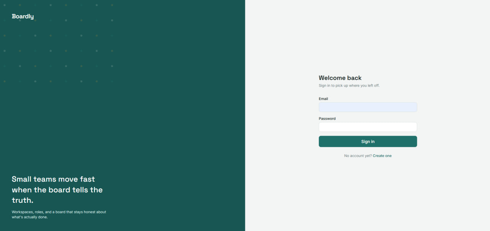
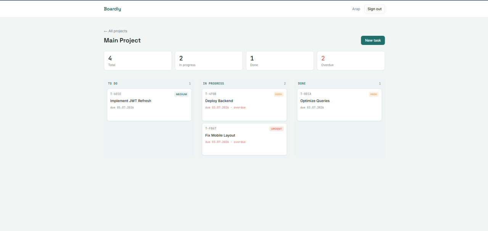
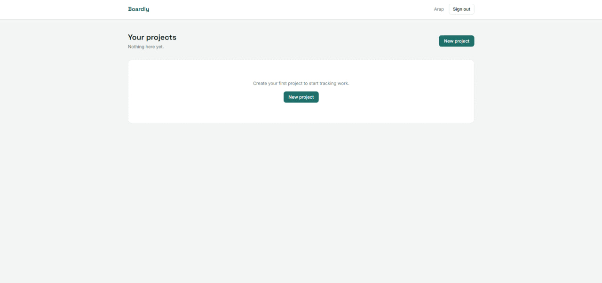
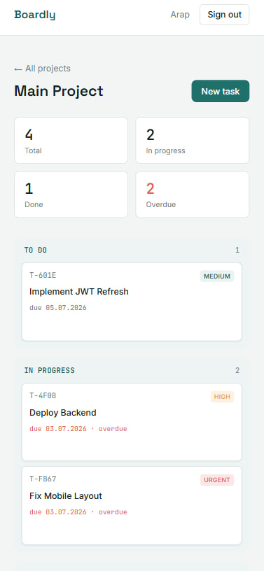

# Boardly

> A modern full-stack Kanban project management application built with React, Express, Prisma and SQLite.

[Live Demo](...) • [API](...)

---

## ✨ Features

- 🔐 JWT Authentication
- 📁 Project Management
- ✅ Kanban Board
- 📊 Dashboard Analytics
- 🔒 Per-user Data Isolation
- 🧪 Backend Tests
- 🐳 Docker Support

---

## 📷 Screenshots

### Login

### Dashboard

### Projects

### Mobile

---

## 🛠 Tech Stack

Frontend

- React
- Vite
- TailwindCSS

Backend

- Node.js
- Express
- Prisma

Database

- SQLite

Authentication

- JWT
- bcrypt

Testing

- Vitest
- Supertest

Deployment

- Docker

---

## 🚀 Getting Started

...

---

## 📁 Project Structure

...

---

## 🔮 Future Improvements

...
